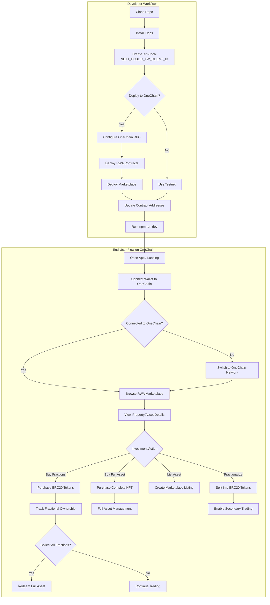

<div align="center">

  <h1>🏠 OneRWA Marketplace</h1>
  
  <p><strong>A decentralized marketplace for tokenized Real-World Assets (RWA) with fractional ownership on OneChain.</strong></p>
  
  <p><strong>🚀 Built on OneChain - the Sui-based blockchain optimized for real-world asset tokenization.</strong></p>
  
  <p>
    <a href="https://nextjs.org/" target="_blank"></a>
    <a href="https://www.typescriptlang.org/" target="_blank"></a>
    <a href="https://chakra-ui.com/" target="_blank"></a>
    <a href="https://sui.io/" target="_blank"></a>
    <a href="https://onechain.network/" target="_blank"></a>
  </p>
</div>

---

## Table of Contents

- [Features](#features)
- [Tech Stack](#tech-stack)
- [Requirements](#requirements)
- [Getting Started](#getting-started)
- [Project Structure](#project-structure)
- [Scripts](#scripts)
- [Environment](#environment)
- [Workflow](#workflow)
- [Mermaid Flowchart (Dev + User Flow)](#mermaid-flowchart-dev--user-flow)
- [Demo](#demo)
- [Troubleshooting](#troubleshooting)
- [Contributing](#contributing)
- [License](#license)
## Gallery


## 🏗️ Property NFT Creation → Fractionalization → Listing Flow

### Complete Workflow

```mermaid
flowchart TD
    Start[Start: Real-World Asset] --> Create[1. Create Property NFT]
    
    Create --> CreateDetails[Property Details:<br/>- Name & Description<br/>- Location & Type<br/>- Total Value<br/>- Total Shares<br/>- Price per Share OCT<br/>- Rental Yield]
    
    CreateDetails --> Mint[2. Mint Property NFT]
    Mint --> MintTx[Transaction on OneChain<br/>PropertyNFT Object Created]
    
    MintTx --> Fractional[3. Automatic Fractionalization]
    Fractional --> FracDetails[Fractional Shares:<br/>- Total Shares: 10,000<br/>- Available: 10,000<br/>- Price: 0.001 OCT/share<br/>- Stored On-Chain]
    
    FracDetails --> List[4. Auto-Listed in Marketplace]
    List --> ListDetails[Marketplace Listing:<br/>- Visible to all users<br/>- Real-time availability<br/>- Instant investment ready]
    
    ListDetails --> Invest[5. Users Can Invest]
    Invest --> InvestOptions{Investment Options}
    
    InvestOptions --> BuyShares[Buy Fractional Shares]
    BuyShares --> ShareDetails[Purchase Details:<br/>- Min: 1 share<br/>- Max: Available shares<br/>- Payment in OCT<br/>- Gas: ~0.05 OCT]
    
    ShareDetails --> InvestNFT[Investment NFT Created]
    InvestNFT --> InvestRecord[Investment Record:<br/>- Property ID<br/>- Shares Owned<br/>- Investment Amount<br/>- Timestamp]
    
    InvestRecord --> Portfolio[6. Track in Portfolio]
    Portfolio --> PortfolioView[My Investments Page:<br/>- Total Invested<br/>- Total Shares<br/>- Properties Owned<br/>- Real-time Updates]
    
    PortfolioView --> Transfer[7. Transfer Shares Optional]
    Transfer --> TransferTx[Transfer Investment NFT<br/>to Another User]
    
    TransferTx --> End[End: Complete Ownership Cycle]
    
    style Create fill:#9f7aea,stroke:#805ad5,color:#fff
    style Fractional fill:#38b2ac,stroke:#319795,color:#fff
    style List fill:#ed8936,stroke:#dd6b20,color:#fff
    style Invest fill:#48bb78,stroke:#38a169,color:#fff
    style Portfolio fill:#4299e1,stroke:#3182ce,color:#fff
```



### Technical Implementation

```mermaid
flowchart LR
    subgraph Creation[Property Creation]
        A[User Input] --> B[CreatePropertyForm]
        B --> C[propertyContract.createProperty]
        C --> D[Move: create_property]
        D --> E[PropertyNFT Object]
    end
    
    subgraph Fractionalization[Built-in Fractionalization]
        E --> F[totalShares: 10000]
        F --> G[availableShares: 10000]
        G --> H[pricePerShare: OCT]
        H --> I[Stored in PropertyNFT]
    end
    
    subgraph Listing[Marketplace Integration]
        I --> J[getAllProperties]
        J --> K[Collection Page]
        K --> L[Display Cards]
        L --> M[Investment Modal]
    end
    
    subgraph Investment[Investment Process]
        M --> N[User Selects Shares]
        N --> O[propertyContract.invest]
        O --> P[Move: invest function]
        P --> Q[Investment NFT Created]
        Q --> R[Shares Deducted]
    end
    
    subgraph Portfolio[Portfolio Tracking]
        R --> S[getUserInvestments]
        S --> T[My Investments Page]
        T --> U[Real-time Balance]
        U --> V[Transfer Option]
    end
    
    style Creation fill:#e6f7ff
    style Fractionalization fill:#f0f5ff
    style Listing fill:#fff7e6
    style Investment fill:#f6ffed
    style Portfolio fill:#fff0f6
```



### Smart Contract Functions

```move
// 1. Create Property NFT
public entry fun create_property(
    name: String,
    description: String,
    image_url: String,
    location: String,
    property_type: String,
    total_value: u64,
    total_shares: u64,
    price_per_share: u64,
    rental_yield: String,
    ctx: &mut TxContext
)

// 2. Invest in Property (Buy Shares)
public entry fun invest(
    property: &mut PropertyNFT,
    payment: Coin<OCT>,
    shares_to_buy: u64,
    ctx: &mut TxContext
)

// 3. Transfer Investment
public entry fun transfer_investment(
    investment: Investment,
    recipient: address,
    _ctx: &mut TxContext
)
```

### Benefits

✅ **Simplified**: No separate fractionalization step  
✅ **Efficient**: One-time property creation  
✅ **Flexible**: Any number of shares (1 to total)  
✅ **Transparent**: All data on-chain  
✅ **Instant**: Immediate marketplace visibility  
✅ **Secure**: Blockchain-verified ownership  
✅ **Transferable**: Investment NFTs can be traded  

---

## OneChain Integration Flow

## Dev + User Flow

